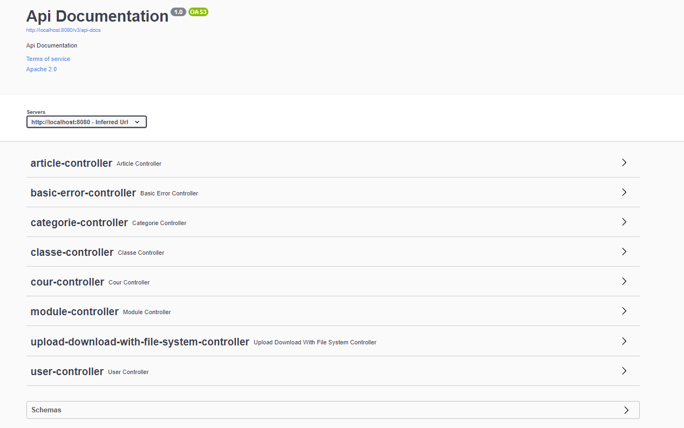
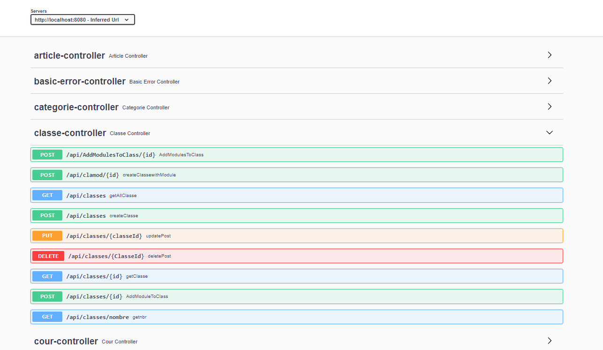
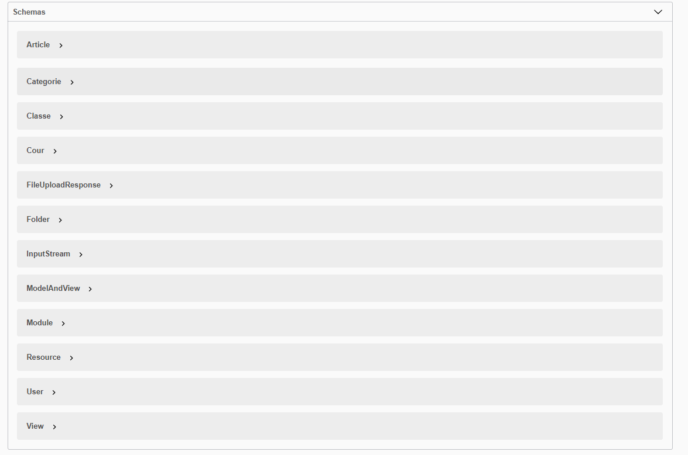
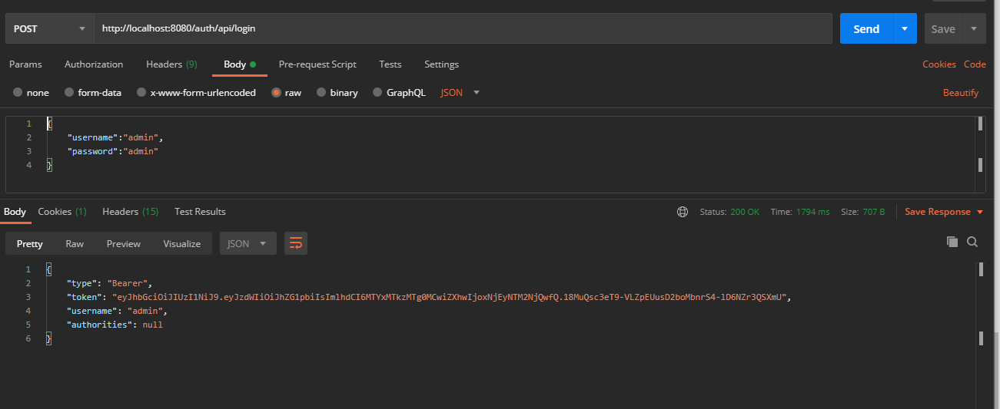

# Elearning Project -Backend part-

E_learning app , backend using Spring boot , JWT..

### Required Tools

- Node v8+ for npm
- Anguar 9+
- Java 8+
- maven v3+
- postman v2+ (To test rest-webservice)

#### Spring boot

- you can test the Backend by using swagger-ui web-application or postman tool

##### Using Swagger-ui

- Go to http://localhost:8080/e-learning/swagger-ui.html#/

##### Using Postman

JWT Auth:

